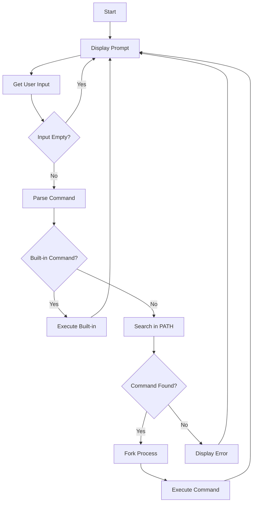

# Simple Shell Project

A simple UNIX command line interpreter implemented in C.

## Description

This Simple Shell project is a minimalist implementation of a command-line interpreter for Unix-like systems. It provides basic shell functionality including command execution, path resolution, and environment variable handling.

## Features

- Interactive command prompt
- Command execution with arguments
- PATH resolution
- Built-in command support
- Error handling and appropriate error messages
- Environment variable handling
- Support for both absolute and relative paths
- Command line argument parsing

## Technical Implementation

### Key Components

1. **Command Parser**
   - Tokenizes input string into command and arguments
   - Handles whitespace and special characters
   - Supports command line parsing with multiple arguments

2. **Path Resolution**
   - Searches for executables in PATH directories
   - Handles both absolute and relative paths
   - Implements efficient path caching mechanism
   - Validates executable permissions

3. **Process Management**
   - Uses fork() to create child processes
   - Implements proper process waiting mechanism
   - Handles zombie process prevention
   - Manages process exit status

4. **Memory Management**
   - Dynamic memory allocation for command strings
   - Proper memory cleanup to prevent leaks
   - Buffer management for input/output operations

5. **Error Handling**
   - Comprehensive error checking
   - Descriptive error messages
   - Proper exit status codes
   - Recovery from common error conditions

## Built-in Commands

The shell supports the following built-in commands:

1. `exit` - Exit the shell
   - Usage: `exit [status]`
   - Example: `exit 98`

2. `env` - Print the current environment
   - Usage: `env`
   - Displays all environment variables

3. `cd` - Change directory
   - Usage: `cd [DIRECTORY]`
   - Supports: `cd`, `cd ~`, `cd -`, `cd /path/to/dir`

## Usage Examples

### Basic Command Execution
```bash
($) ls -l
total 20
-rw-r--r-- 1 user user  234 Dec  5 14:23 main.c
-rw-r--r-- 1 user user  146 Dec  5 14:23 shell.h
($) pwd
/home/user/simple_shell
```

### Path Resolution
```bash
($) /bin/ls
main.c shell.h
($) ls
main.c shell.h
($) /usr/bin/printf "Hello, World!\n"
Hello, World!
```

### Command with Arguments
```bash
($) echo "Hello" "World" "!"
Hello World !
($) touch test_file
($) ls -la test_file
-rw-r--r-- 1 user user 0 Dec 5 14:30 test_file
```

### Environment Variables
```bash
($) echo $PATH
/usr/local/sbin:/usr/local/bin:/usr/sbin:/usr/bin:/sbin:/bin
($) echo $HOME
/home/user
```

### Error Handling
```bash
($) nonexistent_command
./hsh: 1: nonexistent_command: not found
($) /nonexistent/path
./hsh: 1: /nonexistent/path: not found
```

### Pipeline Input
```bash
$ echo "ls -l" | ./hsh
total 20
-rw-r--r-- 1 user user  234 Dec  5 14:23 main.c
-rw-r--r-- 1 user user  146 Dec  5 14:23 shell.h
```

## Flowchart



## Installation

```bash
# Clone the repository
git clone https://github.com/your-username/simple_shell.git

# Compile the program
gcc -Wall -Werror -Wextra -pedantic *.c -o hsh

# Run the shell
./hsh
```

## Usage

The shell can be used in both interactive and non-interactive mode:

### Interactive Mode
```bash
$ ./hsh
($) /bin/ls
hsh main.c shell.c
($) exit
$
```

### Non-interactive Mode
```bash
$ echo "/bin/ls" | ./hsh
hsh main.c shell.c
$
```

## Files Structure

- `main.c`: Contains the main loop and core shell functionality
  - Implements the main shell loop
  - Handles signal interrupts
  - Manages user input/output
  - Coordinates command execution

- `path.c`: Handles PATH resolution and command execution
  - Implements PATH environment variable parsing
  - Manages command path resolution
  - Handles command execution logic
  - Implements process forking and execution

- `shell.h`: Header file with function prototypes and includes
  - Defines all function prototypes
  - Includes necessary system headers
  - Defines constant values and macros
  - Declares global variables

## Authors

- [Edwin](https://github.com/neodwin)
- [Ewan](https://github.com/DARcodertech)
- [Frederic](https://github.com/FredBourouliou)
