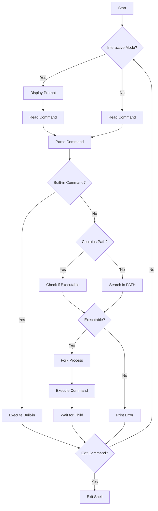

# Simple Shell

A minimalist UNIX command line interpreter implemented in C.

## Overview

This shell project is a streamlined implementation of a command-line interpreter that provides essential shell functionality. It handles both interactive and non-interactive modes, command execution, PATH resolution, and basic built-in commands.

## Features

- Interactive command prompt (`$`)
- Command execution with arguments
- PATH environment variable handling
- Built-in commands: `exit` and `env`
- Error handling with appropriate exit statuses
- Memory management
- Non-interactive mode support (commands from pipes)

## Flowchart



## Technical Details

### Command Processing Flow
1. **Input Reading**:
   - Interactive mode: Display prompt and read user input
   - Non-interactive mode: Read from pipe/file

2. **Command Parsing**:
   - Remove leading/trailing spaces
   - Split command into arguments
   - Handle special characters

3. **Command Execution**:
   - Check for built-in commands
   - Search in PATH if no explicit path
   - Fork and execute command
   - Handle errors and return status

### Built-in Commands
1. `exit [status]`:
   - Exit the shell with optional status
   - Default status: 0
   - Handle illegal status numbers

2. `env`:
   - Print current environment variables
   - No arguments supported

### Error Handling
- Command not found: Exit status 127
- Permission denied: Appropriate error message
- Memory allocation failures: Proper cleanup
- Fork failures: Error message and continue

## Compilation

```bash
gcc -Wall -Werror -Wextra -pedantic -std=gnu89 *.c -o hsh
```

## Usage

### Interactive Mode
```bash
$ ./hsh
$ ls
hsh main.c shell.h
$ pwd
/home/user/simple_shell
$ exit
$
```

### Non-interactive Mode
```bash
$ echo "ls" | ./hsh
hsh main.c shell.h
$ cat test_script | ./hsh
[script output]
```

## Environment

- Tested on Ubuntu 20.04 LTS
- Compiled with gcc 9.4.0
- Follows Betty style guidelines

## Files Description

- `main.c`: Main shell loop and input handling
- `execute.c`: Command execution functions
- `path.c`: PATH handling and command location
- `builtins.c`: Built-in command implementations
- `shell.h`: Header file with prototypes and structures

## Author

    Edwin : https://github.com/neodwin
    Ewan : https://github.com/DARcodertech
    Frederic : https://github.com/FredBourouliou
    